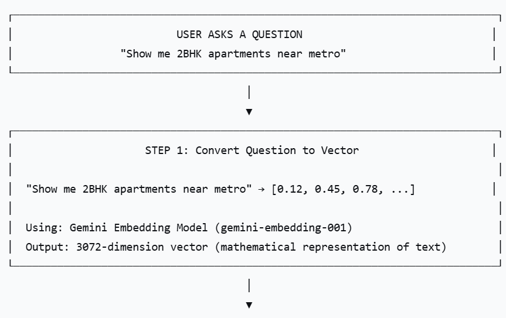
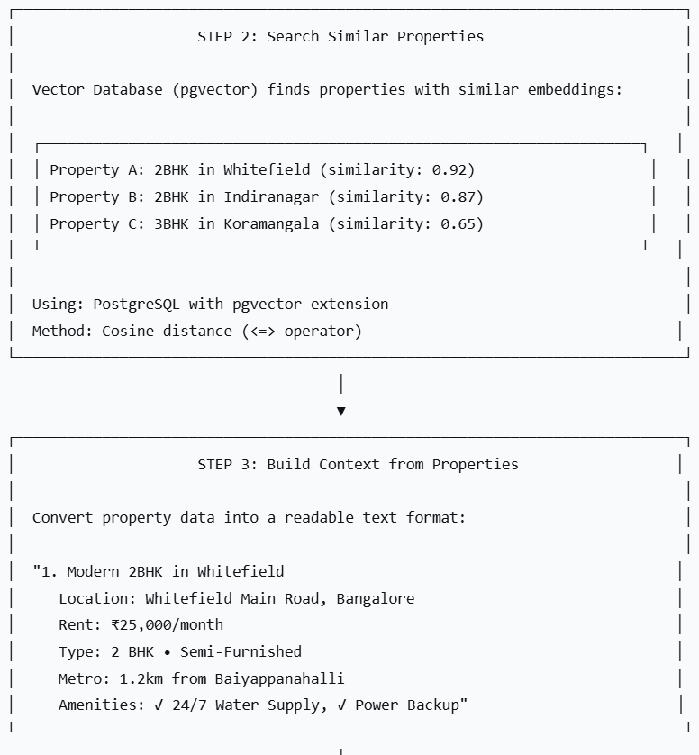
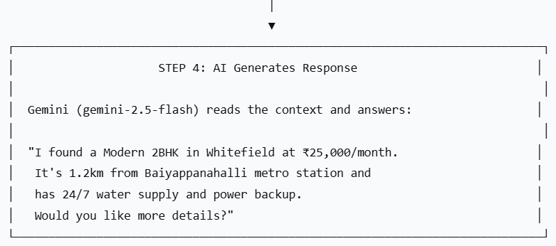

# RAG (Retrieval Augmented Generation) Implementation in UrbanKey

## Overview

UrbanKey uses RAG (Retrieval Augmented Generation) to power its AI-powered property search and chatbot. RAG combines the power of large language models (Gemini) with your specific property database to provide accurate, context-aware responses.

## What is RAG?

Think of RAG as giving the AI a "cheat sheet" before answering questions. Instead of relying only on its training data (which doesn't know your properties), the AI first searches your database for relevant properties, then uses that information to answer.

## How RAG Works in UrbanKey

The Complete Flow





## Key Components

1. Embedding Generation
   Purpose: Convert text into numerical vectors that computers can understand.

```typescript
// Converts any text to a vector
async function generateEmbedding(text: string): Promise<number[]> {
  const model = genAI.getGenerativeModel({ model: "gemini-embedding-001" });
  const result = await model.embedContent(text);
  return result.embedding.values; // Returns array of 3072 numbers
}
```

When it's used:

- When user asks a question (converts question to vector)

- When properties are created/updated (stores property vectors)

2. Vector Search (pgvector)
   Purpose: Find properties whose vectors are closest to the user's question vector.

```sql
-- How pgvector finds similar properties
SELECT * FROM properties
ORDER BY embedding <=> query_vector  -- <=> calculates cosine distance
LIMIT 5
```

What makes properties searchable:
Property text is created by combining:

- Title + Description

- BHK type + Rent

- Location (address, city)

- Metro distance

- Amenities (water, power backup, IGL)

3. Context Building
   Purpose: Convert database results into readable text for the AI.

```typescript
function buildContext(properties) {
  // Takes property objects → Formats as readable text
  // Example output:
  // "1. Modern 2BHK in Whitefield
  //    Rent: ₹25,000/month
  //    Metro: 1.2km from station"
}
```

4. AI Response Generation
   Purpose: Generate natural language answers based on the context.

```typescript
const prompt = `
CONTEXT: (property data from database)
USER QUESTION: (what user asked)
RULES: Only use information from context, be helpful, be concise
ANSWER:
`;
```

## Two Main Use Cases

### Use Case 1: Property Search (Semantic Search)

Where it's used: Property search page with AI search

```
User types: "spacious 2BHK near metro with power backup"
    ↓
Convert to vector
    ↓
Find similar properties
    ↓
Return ranked results
    ↓
User sees properties sorted by relevance
```

Endpoint: GET /api/properties/semantic?q=spacious+2BHK+near+metro

### Use Case 2: AI Chatbot

Where it's used: Chatbot floating button (visible after login)

```
User asks: "What properties have 24/7 water supply?"
    ↓
Check if asking about UrbanKey platform or properties
    ↓
If about properties → Search similar properties
    ↓
Build context from results
    ↓
Generate AI response
    ↓
Save conversation to history
    ↓
Return answer with suggested questions
```

Endpoint: POST /api/chat/ask

## Special Feature: Platform vs Property Questions

```
The system detects two types of questions:

Question Type	    Example	                    How it's handled
About Platform	    "What is UrbanKey?"	            Uses built-in platform context (no property search)
About Properties    "Show me 2BHK apartments"	    Searches property database first
```

```typescript
// Detection logic
const urbanKeyKeywords = [
  "urbankey",
  "platform",
  "how does",
  "features",
  "brokerage",
];
const isAboutPlatform = urbanKeyKeywords.some((keyword) =>
  question.toLowerCase().includes(keyword)
);
```

## Database Schema

Property Embeddings Table

```sql
CREATE TABLE property_embeddings (
  id TEXT PRIMARY KEY,
  property_id TEXT UNIQUE REFERENCES properties(id),
  content TEXT,                    -- Combined property text used for search
  embedding vector(3072),          -- The actual vector (3072 numbers)
  updated_at TIMESTAMP
);
```

Chat History Table

```sql
CREATE TABLE chat_history (
  id TEXT PRIMARY KEY,
  user_id TEXT REFERENCES users(id),
  question TEXT,                   -- What user asked
  answer TEXT,                     -- AI's response
  relevant_property_ids JSON,      -- Which properties were used
  created_at TIMESTAMP
);
```

## Why This Approach is Powerful

```
Traditional Search	        RAG Search
Needs exact keywords	        Understands natural language
Returns based on tags	        Returns based on meaning
"2BHK near metro" works	        "spacious apartment with good connectivity" works
No explanation	                AI explains why property matches
```

### Example Interaction

User: "I need a budget-friendly apartment for bachelors with power backup"

System Flow:

1. Converts question to vector

2. Finds properties with: low rent, bachelor-friendly, power backup

3. Builds context with top 5 matches

4. AI generates: _"I found a Cozy 1BHK in Indiranagar at ₹18,000/month. It has power backup and is bachelor-friendly. Would you like to see more details?"_

Result: User gets exactly what they're looking for without typing complex filters!

## Performance Considerations

```
Metric	                Value
Embedding Generation	~500ms per query
Vector Search	        ~50ms for 10k properties
AI Response	        ~1-2 seconds
Total Response Time     ~2-3 seconds
```
